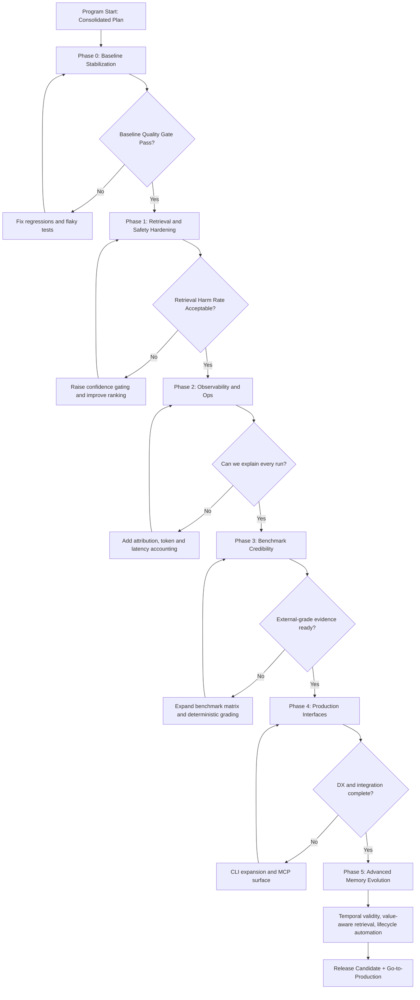
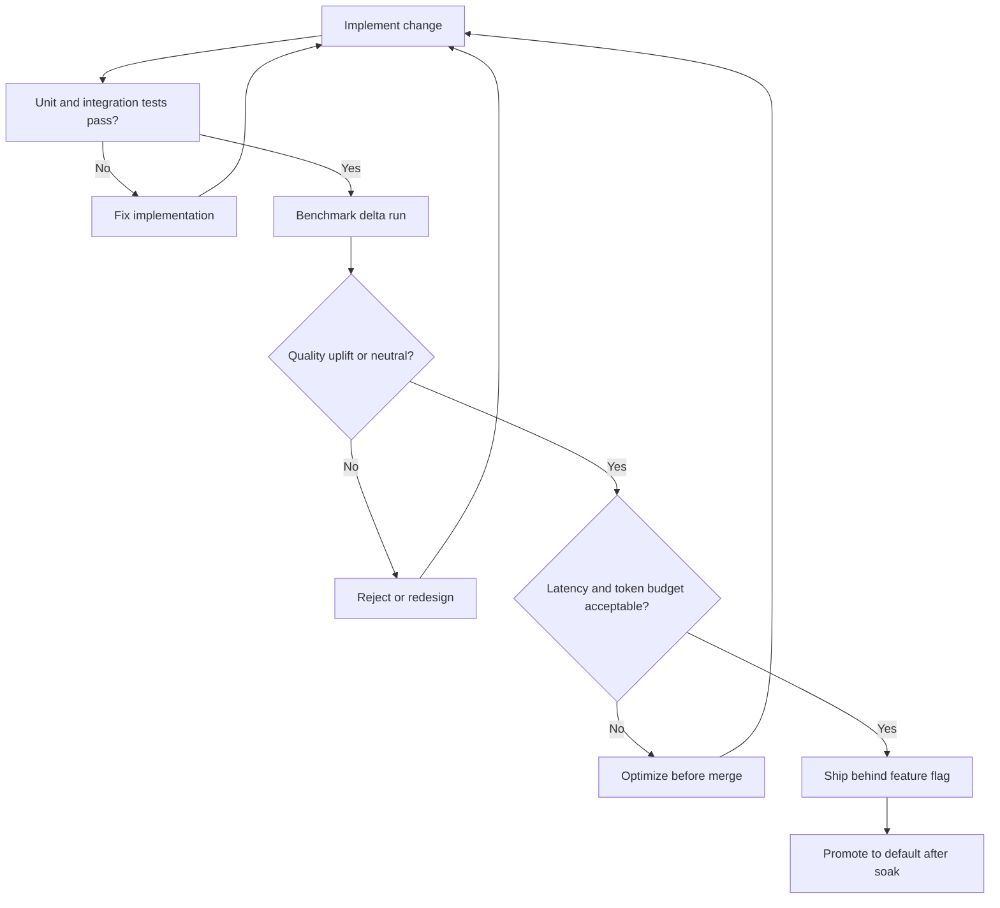

# LearnKit Consolidated Flow Plan

Last updated: 2026-06-20
Owner: LearnKit core team
Status: Active execution blueprint

## Purpose

This document consolidates all major LearnKit plans into one execution flow:

- Existing production blueprint and architecture intent.
- Current sprint backlog and known quality gaps.
- YC-readiness and benchmark-proof requirements.
- Cross-repo additions from MemRL, MemPalace, LightMem, Graphiti, Headroom, mem0, and ACE research.

This is the single planning artifact for sequencing, prioritization, and release gating.

## Source Inputs Consolidated Here

- `agents_v2_production.md`
- `improvements.md`
- `YC_CODEBASE_REVIEW.md`
- `architecture/full_system_flow.mmd`
- Cross-repo code study in:
  - `../MemRL`
  - `../mempalace`
  - `../LightMem`
  - `../graphiti`
  - `../headroom`
  - `../mem0`
  - `../agentic-context-engine`
  - Surveyed but not adopted: `../Godel_Agent`, `../letta`, `../ruflo`, `../MemOS`, `../recursive-improve`, `../hermes-agent` (see Cross-Repo Component Adoption Decisions).

## Current State Snapshot

### Strengths already in place

- End-to-end loop implemented: classify -> retrieve -> route -> compose -> run -> evaluate -> distill -> persist.
- Bounded context routing and k=1 primary memory behavior.
- Distiller payload sanitation and contrastive failure extraction path.
- Harmful-memory demotion and quarantine heuristics.
- Working SQLite + FTS5 default backend.
- Baseline benchmark harness exists.

### Critical gaps to close

- Stronger reproducible benchmark proof (multi-seed, larger n, better grading confidence).
- Better operational visibility (token, latency, memory impact per stage).
- Broader production interfaces (CLI inspection/reporting, optional MCP integration).
- Memory lifecycle controls need stronger explicit APIs (snapshot/restore, reinforcement policy visibility).

## 2026-06-20 Update: Two Learning Paths (Model + Agent)

LearnKit now exposes **two distinct learning entrypoints**, sharing one memory store, quality gates, and retriever. This is the "learning layer you drop into the agent you already have" thesis (vs re-architecting onto a full agent framework).

### Path A — `@lk.learn` (model path) — MATURE

- Single-turn black box: task in, answer string out. Memory injected as text via `_learnkit_context`; only the final answer is judged and distilled.
- This is the original `@lk.agent` decorator, kept as a backward-compatible alias (`agent = learn`). All existing benchmarks (`run_custom.py`, `run_pbebench.py`, `run_slr_bench.py`) use it unchanged.
- Substrate: **declarative** memory (skills/facts/failures as prose injected into the prompt).
- Benchmark standard: `BENCHMARK_SPEC.md` (reuse / transfer / contamination / efficiency; mean_score 0-5, success_rate, harmful_retrieval_rate).
- Validated finding (2026-06-20): real lift only where the base model genuinely lacks the knowledge; net-wash otherwise. The **outcome-gated utility selector** is the keeper (keeps lift, kills harm by outcome not topic) but needs a trustworthy external signal — the internal LLM self-judge is harm-blind.

### Path B — `@lk.agent_learn` (agent path, Hermes-style) — FUNCTIONAL, NOT COMPLETE

- Wraps a tool-using agent. A `ToolTracker` is injected via `_learnkit_tools`; the agent reports each tool call (`record(...)` / `wrap(fn)`).
- Substrate: **procedural** memory. The executed tool-call sequence is captured (`learnkit/procedural.py`), cleaned to the productive path (dead-end calls marked `productive=False` are excluded), and stored as a `SkillRecord` with `procedure` / `tool_sequence` / `trigger` keys that render as a Hermes-style `SKILL.md`.
- **Tool-success gate**: storage/reinforcement is gated on the real tool outcome (`tracker.outcome_score()`), which bypasses the harm-blind LLM judge via `override_score`. This is the QA-era utility-gate insight realized — the agentic loop supplies the trustworthy signal for free.
- **Replay**: a matched stored procedure is attached as a plan (`tracker.set_plan` / `has_plan` / `plan_steps`) so the agent follows the proven sequence instead of re-deriving it.
- Proof harness `benchmarks/run_agent_learn.py` (no LLM): 3 pipeline tasks x 3 rounds → tool-calls/task **5.33 → 3.33 (-37%)**, success held 3/3, converges. Demonstrates the core mechanism.

### What this changes about benchmarking

- Path A is measured by `BENCHMARK_SPEC.md` (answer-quality scores). **Path B cannot be measured that way** — its value is step/cost reduction, not answer quality.
- New requirement: an **agentic benchmark family** for Path B measuring **tool-calls/task, LLM/planning calls, latency, token cost, and success rate over repeated exposures** (Hermes / tau-bench / AWM style), with arms `cold_start` vs `warmed_start`. `run_agent_learn.py` is the seed; it must graduate to real multi-step tool tasks run against a live LLM agent.

### Agent-path gaps (tracked in W6 below)

- Replay requires the agent to check `has_plan` and follow `plan_steps`; not yet auto-short-circuited inside a standard agent loop.
- Procedure match is by retriever rank only — no explicit task-signature / precondition match, so cross-task mismatch is possible on larger task sets.
- Tool args are stored raw/stringified — no parameterization/templating, so replay only generalizes when args are stable.
- Not yet validated against a real tool-using LLM agent (only the deterministic harness).
- No on-disk `SKILL.md` library export/import (Hermes persists skills as directories; LearnKit keeps them in the record store).

## 2026-06-20 Update: True-Learning Loop Status (Delta)

This section captures what changed after AP7-live and what is now proven vs still open.

- **Phase 1 complete:** reflective playbook authoring and accumulation on procedural skills.
  - Distiller reflection (`reflect_procedure`) writes `playbook` / `pitfalls`.
  - Cross-session accumulation merged into `reinforce_or_refine`.
- **Phase 2 complete:** deterministic capture guardrails.
  - `learnkit/playbook.py` now filters non-durable bullets (env/setup failures,
    negative tool claims, transient errors, one-off narration, malformed length).
- **Critical loop fix complete:** playbook is now injected into live guided context.
  - Previously write-only (stored/exported but not injected).
  - `composer._format_record_verbose` now renders `playbook` and `pitfalls`.
- **Quality proof complete (application):** `benchmarks/injection_ablation.py`.
  - 3-arm live ablation: `cold` vs `procedure` vs `playbook` over novel sibling tasks.
  - Result (Qwen2.5-7B): procedure-only was weak; playbook arm reached full compliance.

What this means:

- Replay and procedure scaffolding reduce cost (caching/memoization).
- Injected playbook can improve behavior on non-replayed siblings (learning-by-injection).
- Remaining bottleneck is **playbook authoring quality**, not loop plumbing.

## Consolidated Program Flow

## Workstream Architecture

### W6 Procedural Agent Path (`@lk.agent_learn`)

Net-new workstream from the 2026-06-20 update. Shares the W1–W3 substrate (store, gates, observability) but adds the tool-loop integration and step-reduction proof that W4's answer-quality benchmarks cannot capture.

- AP1 Tool-call capture + procedure cleaning (productive-path extraction). — DONE
- AP2 Tool-success outcome gate (bypass harm-blind judge). — DONE
- AP3 Procedure replay primitive (plan attach + follow). — DONE (manual follow)
- AP4 Auto-short-circuit replay primitive (`learnkit/replay.py::replay_plan`) — framework-agnostic auto-execute of a captured plan with re-bound args. — DONE (primitive; ReAct/LangChain/OpenAI-Agents adapters still TODO)
- AP5 Explicit task-signature match for procedure selection (`procedural.task_signature` / `signature_coverage`, coverage gate in `_select_procedure`, `procedure_match_threshold`). — DONE
- AP6 Argument parameterization / templating (`arg_template` slot markers at capture, `replay.bind_args` re-binding on replay). — DONE
- AP7 Agentic benchmark family (`benchmarks/agentic_bench.py`): cold vs warmed arms, exact-repeat + parameterized-sibling + unrelated tasks, tool-calls/task + success + arg-correctness. — DONE (deterministic harness: warmed 3.83 vs cold 4.83 calls/task, −21%, 6/6 success incl. correct re-bound args)
- AP7-live Live-LLM ReAct benchmark (`benchmarks/react_live.py`) on Qwen2.5-7B-Instruct (hermes tool parser): cold vs warmed with exact-match hard-replay. — DONE. Result: **LLM planning calls 21 → 8 (−62%)**, tool-calls/task 3.50 → 3.00 (−14%), success 6/6. Honest finding: on simple tasks a competent live model has little exploration to cut, so the dominant win is *eliminating planning/LLM calls* by hard-replaying exact re-encounters (zero-LLM), not tool-call reduction.
- AP8 Reflective playbook layer (model-authored natural-language know-how on procedures). — DONE
- AP9 Deterministic capture guardrails for playbook quality (`playbook.py` filters). — DONE
- AP10 Learning-loop closure: inject playbook/pitfalls in composed context. — DONE
- AP11 Injection quality ablation (`benchmarks/injection_ablation.py`) proving playbook effect on novel siblings. — DONE
- AP12 Reflection-quality hardening (semantic dedup + richer authoring tasks + stricter reflection eval). — TODO
- AP13 On-disk `SKILL.md` library import path (export exists). — OPTIONAL

## Prioritized Roadmap

## Phase 0 (Week 0-1): Baseline Stabilization

Objectives:
- Ensure current core loop and tests are stable before adding features.
- Remove documentation drift and benchmark ambiguity.

Deliverables:
- Confirm full local test pass and benchmark smoke pass.
- Align docs and README claims with actual behavior and counts.
- Freeze baseline metrics for before/after comparisons.

Exit criteria:
- No high-severity correctness bugs.
- Stable baseline benchmark run reproducible on clean DB.

## Phase 1 (Week 1-3): Retrieval and Safety Hardening

Objectives:
- Reduce wrong-pattern retrieval harm while preserving memory lift.

Deliverables:
- Improve hybrid ranking policy and confidence-floor controls.
- Add stronger duplicate and near-duplicate prevention at insert.
- Tighten promotion and demotion criteria with explicit policy fields.

Cross-repo additions adopted:
- MemPalace-style BM25 plus vector hybrid scoring.
- MemRL-style richer memory metadata fields for utility tracking.
- mem0-style entity linking to boost recall of related records, plus time-aware ranking (past/present/future intent) layered on the hybrid score.

Exit criteria:
- Harmful retrieval incidents reduced materially in benchmark logs.
- Context contamination cases are detectable and attributable.

## Phase 2 (Week 2-4): Observability and Operations

Objectives:
- Make every run explainable from retrieval to memory updates.

Deliverables:
- Stage-level token and latency accounting (classify/retrieve/compose/run/evaluate/distill).
- Expanded attribution surfaces and maintain-memory diagnostics.
- Snapshot and restore APIs for deterministic reruns.
- Reversible context compression at the compose stage (replace today's lossy line-truncation in `compressor.py`).

Cross-repo additions adopted:
- LightMem-style token and cost monitoring patterns.
- Operational resume/recovery patterns from benchmark toolkits.
- Headroom-style Compress-Cache-Retrieve (CCR): content-aware compressor routing (JSON/code/log/prose) that fits the bounded ~1200-token cap while caching originals for on-demand retrieval, so over-cap records are no longer permanently dropped.

Exit criteria:
- Per-run observability report exists and is machine-readable.
- Snapshot/restore is validated for benchmark reproducibility.
- Compose stage never silently discards retrieved records; truncated content remains retrievable by reference.

## Phase 3 (Week 3-6): Benchmark Credibility and Evidence

Objectives:
- Produce evidence that survives external scrutiny.

Deliverables:
- Multi-seed benchmark protocol with mean and error bars.
- Larger sample runs by domain with deterministic graders where possible.
- Treatment-vs-control analysis including quality, latency, and token cost.

Cross-repo additions adopted:
- LightMem-style three-stage benchmark pipeline discipline.
- MemRL-style multi-benchmark adapter architecture mindset.

Exit criteria:
- Reproducible report with statistically interpretable uplift.
- Harm cases explicitly tracked and mitigations quantified.

## Phase 4 (Week 5-8): Production Interfaces and Developer Experience

Objectives:
- Improve operability and adoption for real teams.

Deliverables:
- CLI expansion beyond maintain: inspect, list, show, export, import, report.
- Optional MCP server for tool-first ecosystems.
- Backend contract improvements with clearer extension boundaries.

Cross-repo additions adopted:
- MemPalace MCP server conventions.
- MemPalace backend capability signaling pattern.

Exit criteria:
- Core operations are executable from CLI alone.
- External clients can integrate without custom glue.

## Phase 5 (Week 8+): Advanced Memory Evolution

Objectives:
- Move from static confidence memory to adaptive memory economics.

Deliverables:
- Value-aware retrieval policies with optional Q-like utility feedback.
- Bi-temporal validity model for facts with contradiction-driven invalidation and stale-knowledge filtering.
- Episode provenance: every distilled Fact/Skill traces back to the source trace that produced it.
- Iterative (recursive) reflection in the distiller as an optional deeper-analysis mode.
- Optional layered context strategy (identity/core/on-demand/deep).

Cross-repo additions adopted:
- MemRL value-aware selection and utility update principles.
- Graphiti bi-temporal fact model (`valid_at`/`invalid_at` real-world window plus `created_at`/`expired_at` transaction window) with automatic invalidation on contradiction — supersedes the simpler MemPalace `valid_from`/`valid_to` model — and episode-style provenance from fact back to source trace.
- ACE-style recursive reflection: multi-pass, evidence-seeking distillation as an opt-in upgrade over single-pass contrastive extraction.
- LightMem online/offline update separation.

Exit criteria:
- Adaptive policies improve outcomes without regressions in latency/cost.
- Temporal and lifecycle semantics are test-covered and documented.
- Fact invalidation preserves history (facts are superseded, not deleted) and is auditable via provenance.

## Unified Backlog (Consolidated)

### Immediate (P0)

- Retrieval harm mitigation and confidence policy tuning.
- Benchmark reproducibility and multi-seed reporting.
- Token/latency attribution across all loop stages.
- CLI inspect and report commands.

### Near-term (P1)

- Agent path (`@lk.agent_learn`): graduate `benchmarks/agentic_bench.py` to a live LLM agent (e.g. ReAct on the Qwen endpoint); report tool-calls/task, planning calls, latency, and cost over repeats (AP7 live run).
- Agent path: ship a ReAct/LangChain/OpenAI-Agents adapter that auto-invokes `replay_plan` inside a real tool loop (AP4 adapter). Signature match (AP5) and argument parameterization (AP6) are implemented; harden slot detection (current binder needs caller-supplied overrides for new slot values).
- Snapshot/restore support in backend contract.
- MCP tool surface for memory operations.
- Strategy configuration abstraction for retrieval/build/update mode experiments.
- Explicit promotion API and confidence-floor policy docs.
- Reversible content-aware context compression (Headroom CCR) replacing lossy truncation at compose.
- Entity-linked + time-aware retrieval boosting (mem0).

### Strategic (P2)

- Bi-temporal validity schema for facts with contradiction-driven invalidation and episode provenance (Graphiti).
- Value-aware retrieval and reinforcement loop.
- Recursive/iterative reflection mode in the distiller (ACE).
- Layered context delivery modes.

## Cross-Repo Component Adoption Decisions

Every workspace repo was assessed against LearnKit's existing and already-planned capabilities. A component is adopted only if it is distinct from what LearnKit already has (k=1 primary, MMR diversity, confidence floors, harmful-hit quarantine, contrastive failures, typed records, SQLite+FTS5+sqlite-vec) and aligned with its local-first, agent-agnostic, text-first SDK philosophy.

| Repo | Candidate component | Decision | Rationale |
|------|--------------------|----------|-----------|
| Graphiti | Bi-temporal fact validity + contradiction-driven invalidation + episode provenance | Adopt (Phase 5 / P2) | `FactRecord` has no temporal fields today; richer than the previously planned MemPalace model. History-preserving invalidation and provenance are net-new. |
| Graphiti | Neo4j/FalkorDB graph traversal retrieval | Reject | Heavy external graph-DB dependency conflicts with local-first SQLite default; hybrid BM25+vector already planned. |
| Headroom | Compress-Cache-Retrieve (reversible, content-aware compression) | Adopt (Phase 2 / P1) | Current `compressor.py` is lossy line-truncation that permanently drops over-cap records; CCR keeps originals retrievable and routes by content type. |
| Headroom | Proxy / wrap / output-token shaping | Reject | Runtime-proxy and output-steering features are out of scope for an embedded SDK. |
| Headroom | `headroom learn` (mine failed sessions → corrections) | Reject (convergence) | Already LearnKit's distiller + contrastive failure path; validates the design rather than adding to it. |
| mem0 | Entity linking + time-aware retrieval ranking | Adopt (Phase 1 / P1) | Complements planned BM25+vector with relation-aware recall and temporal intent ranking. |
| ACE | Recursive/iterative reflection with evidence-seeking | Adopt (Phase 5 / P2, opt-in) | Deeper, multi-pass distillation upgrade over single-pass contrastive extraction. |
| hermes-agent | Cross-session user/preference modeling | Defer | `PreferenceRecord` partially covers this; revisit only if preference quality lags. |
| recursive-improve | Live (pre-hoc) trace-capture hooks | Reject (deliberate) | LearnKit distills after-the-fact by design; already referenced in `memory_quality.py`. |
| MemOS | Multi-modal (image/persona) memory | Reject | Conflicts with text-first SDK scope; tool-trace structuring already covered by `TraceRecord`. |
| Godel_Agent | Self-modifying code generation | Reject | Narrow to coding-agent self-edits; outside experience-distillation scope. |
| letta | Named memory blocks | Reject | Simpler than existing typed-record model; nothing new. |
| ruflo | Federated multi-agent memory sharing | Reject | Distributed swarm model conflicts with local-first single-agent design. |

## Decision Gates

## Ownership Model

- Runtime and retrieval hardening: Core SDK maintainers.
- Benchmarking and evidence: Evaluation workstream.
- CLI and integration surface: Developer experience workstream.
- Memory lifecycle and advanced evolution: Research-to-production workstream.

## Risks and Mitigations

- Risk: Overfitting retrieval policies to custom benchmarks.
  - Mitigation: Maintain external benchmark set and multi-seed protocol.
- Risk: Added complexity reduces developer ergonomics.
  - Mitigation: Keep defaults simple, ship advanced features behind flags.
- Risk: Cost/latency creep from richer instrumentation.
  - Mitigation: Sampling and configurable telemetry levels.
- Risk: Lifecycle policy conflicts across domains.
  - Mitigation: Domain-aware policy profiles with safe global fallback.

## Release Readiness Checklist

- Correctness: All core tests passing, no known high-severity defects.
- Safety: Harmful retrieval controls validated on benchmark suite.
- Observability: Attribution and cost traces available for every benchmark run.
- Evidence: Treatment-vs-control report with confidence intervals.
- Operability: CLI and maintenance workflows documented and validated.
- Integrations: Adapters and optional MCP path smoke-tested.

## How to Use This Document

- Use this as the canonical sequence for planning and execution.
- Update phase status and exit criteria weekly.
- Reject unscoped feature work that does not map to a phase or workstream.
- Link every PR to one item in this plan.
