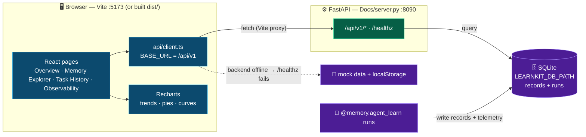

# LearnKit Observability Dashboard — Frontend Client

This is the Vite + React + TypeScript observability dashboard for LearnKit, built to match the **v1.1 Frontend Design Document**.

## Features

- **Dashboard Home**: Live stats cards, task metric aggregations, primary record injection distributions, and success rate trends comparing evaluation arms.
- **Playground**: Submit tasks to see real-time task type classification, confidence-weighted memory retrieval, and system context prompt composition.
- **Memory Explorer**: Search, sort, filter, view details, edit, add, and delete records across all 7 types of memories (`Skill`, `Fact`, `Failure`, `Strategy`, `Preference`, `Heuristic`, and `Trace`).
- **Retrieval Quality**: Track average context utilization, pairwise Jaccard redundancy indicators, inference mode splits, MMR diversity parameters, and consolidate duplicated crowded-out records.
- **Task History**: Timeline list of past evaluation tasks with navigation to vertical trace timelines.
- **Trace Playback**: Detailed playback timelines showing prompt queries, retrieved matches, MMR-dropped records, injected context formatting, CoT reasoning steps, and human-in-the-loop attribution feedback buttons (Reinforce/Demote).
- **Memory Lifecycle**: Manage quarantined records and trigger automated maintenance curation routines (decaying confidence score rates, staling low-performance items).
- **Settings**: Adjust threshold configurations, quarantine limits, automatic decay policies, PII scrubbing expressions, and local-first compliance constraints.

## Tech Stack

- **Framework**: React 18+ & TypeScript (strict compiler settings)
- **Tooling**: Vite (hot reloading, development proxy configuration)
- **Routing**: React Router v6
- **Styling**: Pure CSS Modules (no third-party styling frameworks, styled according to theme design tokens)
- **Charts**: Recharts
- **Aesthetics**: Sleek dark mode utilizing deep glassmorphic layers, harmonize accents (`#00ff88` and `#a78bfa`), smooth page transitions (200ms), and hover micro-animations.

## Installation & Running

1. Make sure you have **Node.js** (v18+) and **npm** installed on your system.
2. Navigate to this directory in your terminal:
   ```bash
   cd LearnKit/Docs/dashboard
   ```
3. Install the dependencies:
   ```bash
   npm install
   ```
4. Run the local development server:
   ```bash
   npm run dev
   ```
5. Open your browser to the local server address shown in the terminal (typically `http://localhost:5173/dashboard/`).

## API Proxy

The Vite dev server proxies any request starting with `/api` or `/healthz` to the
FastAPI backend at `http://127.0.0.1:8090` (see [`vite.config.ts`](vite.config.ts)).
`:8090` is the dashboard backend (`Docs/run_server.py`); `:8000` is reserved for a
self-hosted model endpoint. If the backend is offline, the dashboard falls back to
a `localStorage`-backed mock layer so every screen still renders.

## How it starts

**Dev (hot reload):**

```bash
cd Docs/dashboard
npm install
npm run dev            # Vite on http://localhost:5173 → opens the landing page
```

`npm run dev` serves a **multi-page app** (see [`vite.config.ts`](vite.config.ts)):

- `index.html` → the marketing **landing** page (opens by default)
- `app.html` → the **React dashboard** (HashRouter sub-app) — open `http://localhost:5173/app.html`
- `docs.html` → a standalone docs page

**Production build:**

```bash
npm run build         # tsc + vite build → dist/ (main / app / docs bundles)
```

In production the FastAPI server serves the built `dist/`, so one process hosts
both the API and the UI.

## How data flows and is visualized



**In words:**

1. Each React page calls a typed getter in [`src/api/client.ts`](src/api/client.ts).
2. The client fetches `/api/v1/...`; Vite proxies it to FastAPI on `:8090`.
3. [`Docs/server.py`](../server.py) reads the SQLite store at `LEARNKIT_DB_PATH`
   (two tables: `records` = typed memory, `runs` = per-run telemetry) and returns JSON.
4. Pages render the JSON as cards, tables, and **Recharts** visualizations
   (success-rate trend, injection pie, learning curve).
5. On a fresh checkout with no backend, `client.ts` probes `/healthz`; if it fails
   it serves `localStorage`-backed **mock** data so every screen still works.

## See real data instead of mock

To populate the dashboard with **real agent runs**:

```bash
# 1) Launch the backend (sets LEARNKIT_DB_PATH + runs uvicorn on :8090)
python Docs/run_server.py

# 2) Seed real @memory.agent_learn runs into the same store
python -m benchmarks.seed_dashboard

# 3) Open the dashboard
cd Docs/dashboard && npm run dev      # then open http://localhost:5173/app.html
```

The API contract lives in [`Docs/server.py`](../server.py) (`/api/v1/metrics`,
`/records`, `/records/{id}`, `/records/{id}/reinforce|demote`, `/tasks`,
`/observability`, `/agents`, `/benchmarks`). Anything not implemented falls back
to mock per-screen so the UI never breaks.

> **Note:** the `agentic_*` benchmarks use `db_path=":memory:"` and do **not**
> populate the dashboard. Use `benchmarks/seed_dashboard.py` (or any
> `@memory.agent_learn` script with `db_path` = `LEARNKIT_DB_PATH`) for real traces.
