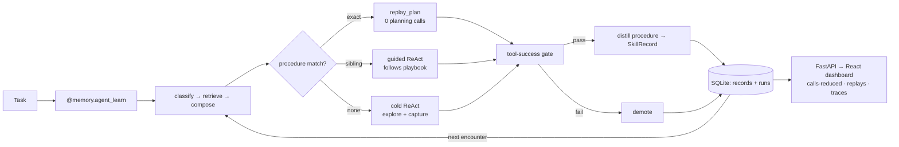

# LearnKit

**Procedural memory for tool-using AI agents.** Capture the tool procedure that solved a task, replay it on exact repeats with **zero planning calls**, and guide similar tasks with a learned playbook.

[](https://pypi.org/project/learnkit-ai/) [](LICENSE) [](pyproject.toml) [](https://deepwiki.com/siddhu1716/LearnKit)

> **v1.0** · `pip install learnkit-ai` · wrap one function · watch it stop re-planning.

[Developer guide](DEVELOPERS.md) · [Release guide](RELEASING.md) · [Changelog](CHANGELOG.md)

---

# Stop Re-Planning the Same Task

LearnKit is an **agent-agnostic SDK** that makes tool-using AI agents **learn from experience**. It captures the tool-call *procedure* an agent uses to solve a task, then:

- **replays it on exact repeats with zero planning/LLM calls**, and
- **guides sibling tasks with a distilled playbook** so the model follows the proven shape instead of re-exploring.

The expensive, compressible part of a tool-using agent isn't the answer text — it's the **planning loop** (the back-and-forth LLM calls to decide which tools to call in what order). That plan is normally thrown away after every task. LearnKit keeps it, quality-gates it on the **real tool outcome** (not a fragile LLM judge), and reuses it.

**Reproducible result (agentic matrix, 3/3 models PASS, equal task success):**

> **+2.25 best quality lift · −38.4% pooled LLM planning calls** on Qwen2.5-14B/32B and Llama-3.3-70B.

Memory is **typed**, **quality-gated**, **attributed** (help/harm/reuse per record), and **lifecycle-managed** (confidence decay, quarantine → promote, TTL) — auditable, deletable JSON, no model retraining.

---

## Where this fits — procedural memory, not caching or hand-written skills

LearnKit adds **procedural memory** (how to do a task) — distinct from the
semantic/episodic memory that Mem0, Zep, and vector stores provide (facts and past
conversations).

- **Not plan caching.** Plan caching keys a whole plan and trades accuracy for cost.
  LearnKit does *workflow induction*: hard-replay only on an **exact** match (zero
  LLM), and *guide* sibling tasks (the model still plans) — never a fuzzy replay
  that could silently produce the wrong result. Success holds; it doesn't degrade.
- **Not hand-written Skills.** LangChain / Deep Agents Skills are procedural memory
  too, but you author and maintain each one by hand. LearnKit **auto-induces**
  procedures from real successful runs, quality-gates them on the tool outcome,
  tracks help/harm, and decays the stale ones — and it's framework-agnostic. It
  even exports a Deep Agents-compatible library:
  `learnkit skills export --format deepagents`.

# Architecture at a glance



The wrapped agent function never changes — the `@memory.agent_learn` decorator
orchestrates everything around it. Full, detailed diagrams live in
[`architecture/`](architecture/); see [How it works](#how-it-works--the-8-step-loop)
for the step-by-step.

> 🎨 A colored, presentation-ready version is in [`architecture/high_level_architecture.mmd`](architecture/high_level_architecture.mmd) — render it at [mermaid.live](https://mermaid.live) and export a PNG.

---

To install from PyPI (recommended):

```bash
pip install learnkit-ai
# Or with integration extras:
pip install "learnkit-ai[langchain]"
# Coding-agent MCP + hook runtime:
pipx install "learnkit-ai[coding-agents]"
```

To install from local repo root:

```bash
pip install -e .                    # core SDK
pip install -e ".[langchain]"       # adds LangChain + langchain-anthropic
pip install -e ".[dev]"             # pytest + pytest-asyncio
```

Other optional extras: `mem0`, `zep`, `qdrant`, `dashboard`, and `coding-agents`.

Set your Anthropic key (optional — only the LLM classifier/distiller use it; the
agent path and benchmarks run keyless). PowerShell, persists across sessions:

```powershell
[Environment]::SetEnvironmentVariable("ANTHROPIC_API_KEY", "sk-ant-...", "User")
```

On bash/zsh: `export ANTHROPIC_API_KEY=sk-ant-...` in your shell rc.

---

# 60-second Quick Start

```bash
python examples/agent_learn_demo.py
```

A runnable, **offline** (no API key) demo of the cold→warm capture-and-replay
loop: on first exposure the agent explores and LearnKit captures the productive
tool procedure; on repeats it replays that procedure with zero planning calls.

---

# Wrap your agent — the agent path (`@memory.agent_learn`)

```python
import learnkit as lk

memory = lk.LearnKit(memory_backend="sqlite", scope="team")

@memory.agent_learn(domain="pipeline")
def my_tool_agent(task: str, _learnkit_context: str = "", _learnkit_tools=None) -> str:
    # Record every tool call so LearnKit can learn / replay the productive procedure.
    rows = _learnkit_tools.record("query", {"table": "users"}, run_query("users"))
    _learnkit_tools.record("format", {"fmt": "csv"}, to_csv(rows))
    return "report ready"

# Same task, called twice — run 2 replays run 1's captured procedure (zero planning calls).
my_tool_agent("Build an active-user CSV report")
my_tool_agent("Build an active-user CSV report")
```

Valid `scope` values: `"user"`, `"team"`, `"public"` (see `learnkit/schemas/base.py`).

## Auto-replay — zero-wiring reuse (`run_react_agent`)

Don't want to hand-check `has_plan`/`plan_steps`? Use the built-in ReAct runner.
It prepares the run, retrieves any matching procedure, **auto-replays exact
matches with zero planning calls**, and otherwise drives your planner while
capturing the trajectory:

```python
from learnkit import run_react_agent, LLMStep, ToolCall

def planner(task, context, history):
    # One planning turn. Return tool calls to make, and/or a final answer.
    # `context` already contains playbook guidance for sibling tasks.
    ...
    return LLMStep(tool_calls=[ToolCall("query", {"table": "users"})], final=None)

result = run_react_agent(memory, task, tools, planner, exploration_tools={"list_tables"})
print(result.replayed, result.llm_calls, result.tool_calls)  # True 0 3  on an exact repeat
```

This path supports exact replay (zero-LLM for exact re-encounters) and guided
sibling reuse. A runnable, offline demo (no API key) lives at
[`examples/agent_learn_demo.py`](examples/agent_learn_demo.py). See
`benchmarks/injection_ablation.py` for a quality-focused ablation that isolates
the effect of playbook injection on novel sibling tasks.

## Coding-agent integrations (preview)

LearnKit's full coding-agent integration has two layers: install the Python
engine from PyPI, then install the host plugin or hook configuration. No Git
clone is required for the engine. Lifecycle hooks capture prompts and tool
outcomes across separate host processes; the stop hook turns a successful tool
sequence into a local procedural skill. The read-only MCP server exposes:

- `learnkit_status` — database, hook-journal, and MCP health;
- `learnkit_search` — typed memory search;
- `learnkit_procedures` — learned tool workflows; and
- `learnkit_context` — bounded guidance for a new task.

Install the plugin extra first:

```bash
pipx install "learnkit-ai[coding-agents]"
learnkit plugin doctor
```

The GitHub release tag `v2.0` corresponds to canonical Python package version
`2.0.0`. PyPI normalizes the release to that three-component version.

Claude Code:

```text
/plugin marketplace add siddhu1716/LearnKit
/plugin install learnkit@learnkit
```

GitHub Copilot CLI:

```bash
copilot plugin install siddhu1716/LearnKit:plugins/learnkit
```

Codex CLI:

```bash
codex plugin marketplace add siddhu1716/LearnKit
codex plugin add learnkit@learnkit
```

Gemini CLI installs the repository as an extension after the first tagged
release:

```bash
gemini extensions install https://github.com/siddhu1716/LearnKit --ref v2.0
```

Antigravity CLI:

```bash
agy plugin install https://github.com/siddhu1716/LearnKit/tree/v2.0/plugins/learnkit-antigravity
```

Antigravity IDE is MCP-only, and VS Code Copilot has partial hook capture. See
the [developer guide](DEVELOPERS.md#host-integrations) for exact configuration,
capability boundaries, local development commands, and dashboard setup.

Set `LEARNKIT_DB_PATH` to isolate a test database and
`LEARNKIT_PLUGIN_DIR` to isolate hook journals.

The preview captures and retrieves procedures but does not directly execute
native host tools. Exact zero-planning replay remains available through
`run_react_agent`, where LearnKit owns the tool registry and can enforce the
outcome gate. Host-side automatic execution will remain opt-in until the host
provides a safe execution and approval contract.

---

# Integrate with LangChain (and others)

LangChain, LangGraph, AutoGen, CrewAI, LlamaIndex, and the OpenAI Agents SDK are
all supported through the universal adapter contract described in **Framework
integrations** below. Each adapter captures tool calls onto the run so the agent
path learns and replays procedures with no change to your agent logic.

---

# Framework integrations

LearnKit is framework-agnostic. Every integration subclasses one universal
contract (`learnkit.adapters.BaseAdapter`), so they all expose the same
agent-path API — `start_run` → inject memory + arm the ToolTracker,
`complete_run` → capture and distill the procedure — and an exception-safe
`session()` / `asession()` lifecycle.

| Framework | Adapter | Install | Native hook |
|---|---|---|---|
| LangChain | `LangChainAdapter` | `learnkit-ai[langchain]` | `LearnKitCallbackHandler` (`BaseCallbackHandler`) |
| LangGraph | `LangGraphAdapter` | `learnkit-ai[langgraph]` | `as_node()` graph node |
| AutoGen / AG2 | `AutoGenAdapter` | `learnkit-ai[autogen]` | `inject()` system-message + `ChatResult` capture |
| CrewAI | `CrewAIAdapter` | `learnkit-ai[crewai]` | `step_callback()` (`AgentAction`) |
| LlamaIndex | `LlamaIndexAdapter` | `learnkit-ai[llamaindex]` | `LearnKitLlamaHandler` (`FUNCTION_CALL` events) |
| OpenAI Agents SDK | `OpenAIAgentsAdapter` | `learnkit-ai[openai-agents]` | `LearnKitRunHooks` (`RunHooks`) |
| Raw OpenAI / Anthropic | `OpenAIRawAdapter` | core | wraps the chat call |

```python
from learnkit import LearnKit
from learnkit.adapters import get_adapter

lk = LearnKit(memory_backend="sqlite")
adapter = get_adapter("crewai")(lk)        # resolve any adapter by name

with adapter.session(task) as run:          # exception-safe lifecycle
    tools = adapter.wrap_tools(run, tools)  # agent path: capture tool calls
    run.response = my_agent(run.context, tools)
```

Any third-party package can register its own adapter without a PR — declare a
`learnkit.adapters` entry point and LearnKit discovers it lazily via
`get_adapter(name)` / `available_adapters()`.

### Offline mode (no API key)

When no LLM provider key is set, LearnKit runs **keyless**: task classification
falls back to a deterministic heuristic instead of a network call, so the agent
path and the deterministic benchmarks run with zero credentials and zero
latency. Force it explicitly with `LEARNKIT_OFFLINE=1`; it is auto-detected
otherwise (no provider key and no `LEARNKIT_CLASSIFIER_MODEL` override).

---

# How it works — the 8-step loop

The agent function never changes. The decorator orchestrates everything around it.

1. User calls your wrapped agent with a task.
2. **Classify** — `TaskClassifier` returns a domain vector, e.g. `{"Python": 0.9, "Concurrency": 0.7}`.
3. **Retrieve** — `SemanticRetriever` pulls relevant records (FTS5 lexical + optional dense rerank), filtered by `domain` and `scope`.
4. **Compose** — `compose_context` formats records into a bounded prompt block (≤ 8 records, ≤ 1,200 tokens, inference mode = `PRESCRIPTIVE` / `GUIDED` / `EXPLORATORY` based on top-record confidence).
5. **Run** — your function executes with `_learnkit_context` injected as a kwarg.
6. **Evaluate** — on the agent path the outcome is gated on the **real tool success** (`ToolTracker.outcome_score()`), not a fragile LLM judge; an optional judge scores 0–5 when no tool signal is available.
7. **Distill** — a passing run captures the cleaned productive tool sequence into a procedural `SkillRecord` (`procedure` / `tool_sequence` / `trigger`) for replay, plus optional facts/failures. Below threshold, a `FailureRecord` is stored directly so future runs avoid the same path.
8. **Persist** — records are written via the active backend; the trajectory is registered against a per-run ID for inspection.

---

# Memory model

LearnKit stores seven typed record kinds (`learnkit/schemas/`):

| Record | Activates as | Notes |
|---|---|---|
| `SkillRecord` | `quarantine` | Promoted to `active` after the configured probation window |
| `FactRecord` | `quarantine` | Same probation as skills |
| `FailureRecord` | `active` immediately | Per ReaComp — agents must avoid known dead ends as fast as possible |
| `StrategyRecord` | `quarantine` | Higher-level approaches |
| `PreferenceRecord` | `quarantine` | User / team preferences |
| `TraceRecord` | `active` | Raw execution trace for replay |
| `HeuristicRecord` | `quarantine` | Domain heuristics |

Bounded memory is enforced at retrieval: the router caps results at **8 records / ~1,200 tokens** before the composer formats them.

---

# Maintenance

Call `memory.maintain_memory()` periodically (cron, background job, etc.):

```python
memory.maintain_memory(weeks=1, decay_rate=0.02, quarantine_hours=24)
# → {"decayed": N, "stale": M, "promoted": K}
```

- **Decay**: every active/stale record loses `decay_rate` confidence per `weeks` elapsed.
- **Stale**: records past `expires_at` get marked `stale` and excluded from retrieval.
- **Promote**: quarantined records older than `quarantine_hours` are promoted to `active`.

---

# Project structure

```text
learnkit/
├─ core.py            # orchestrator: @memory.agent_learn, prepare_run → finalize_run → post-process
├─ tool_tracker.py    # ToolTracker — captures tool calls, tool-success gate, plan attach
├─ procedural.py      # extract_procedure, task-signature / coverage matching
├─ replay.py          # replay_plan — execute a captured procedure with 0 LLM calls
├─ adapters/react.py  # run_react_agent — auto-replay ReAct runner
├─ drift.py           # check_drift + golden-suite export (procedure regression)
├─ retriever.py       # hybrid FTS5 + dense retrieval
├─ router.py          # bounded retrieval plan (≤ 8 records / ~1,200 tokens)
├─ composer.py        # compose_context — the injected prompt block
├─ distiller.py       # MemoryDistiller (DSPy) — distills records
├─ memory_quality.py  # storage gates, confidence, help/harm utility
├─ schemas/           # 7 typed record kinds (SkillRecord, FailureRecord, …)
├─ backends/          # SQLite (default) + Qdrant / Mem0 / Zep + registry
├─ adapters/          # LangChain, LangGraph, CrewAI, AutoGen, LlamaIndex, OpenAI
└─ cli.py             # `learnkit maintain`, `learnkit skills export`

architecture/          # Mermaid diagrams (product map · agent runtime · storage · benchmark)
benchmarks/            # agentic suite + reproducible RESULTS.json / MATRIX.md
Docs/                  # FastAPI server + React observability dashboard
examples/              # runnable demos (agent_learn_demo.py — offline, no key)
tests/                 # pytest suite
```

---

# Contributing

Contributions are welcome — see **[CONTRIBUTING.md](CONTRIBUTING.md)** for the
full guide (setup, structure, PR checklist, design principles).

```bash
git clone https://github.com/siddhu1716/LearnKit && cd LearnKit
python -m venv .venv && . .venv/Scripts/Activate.ps1   # bash: source .venv/bin/activate
pip install -e ".[dev]"
pytest -q                     # run the test suite (offline, no key)
ruff check learnkit tests     # lint
pre-commit install            # enable commit hooks
```

The observability dashboard (`Docs/dashboard`) builds with `npm install && npm run build`.

---

# Architecture docs

All diagrams live in [`architecture/`](architecture/):

| Diagram | Shows |
|---|---|
| [`high_level_architecture.mmd`](architecture/high_level_architecture.mmd) | **colored, at-a-glance overview** (screenshot-ready) |
| [`product_architecture.mmd`](architecture/product_architecture.mmd) | the whole system, subsystem by subsystem |
| [`agent_runtime_flow.mmd`](architecture/agent_runtime_flow.mmd) | one task: capture → match → replay/guide → gate → persist |
| [`storage_lifecycle.mmd`](architecture/storage_lifecycle.mmd) | a record's lifecycle (quarantine → active → decay) |
| [`benchmark_flow.mmd`](architecture/benchmark_flow.mmd) | how the reproducible benchmark numbers are produced |

---

# Benchmarks & status

**v1.0.** The agent path (`@memory.agent_learn`) is the product: procedure
capture, exact-match replay (zero planning calls), and guided sibling reuse,
over a SQLite + FTS5 store with a React observability dashboard.

Reproduce the published numbers in one command (offline, from committed runs):

```bash
python -m benchmarks.make_results     # regenerates benchmarks/RESULTS.json + MATRIX.md
```

Agentic matrix (`trials=1`, `k=1`, `seed=7`, `temperature=0`) — 3/3 models PASS
the `playbook_effect ≥ 0.5` gate at **equal task success**:

| Model | Gate | Quality lift | LLM calls (pooled) |
|---|---|---|---|
| `Qwen2.5-14B-Instruct` | ✓ PASS | +1.875 | 53 → 30 (−43%) |
| `Qwen2.5-32B-Instruct` | ✓ PASS | +1.75 | 44 → 28 (−36%) |
| `Llama-3.3-70B-Instruct` | ✓ PASS | +2.25 | 88 → 56 (−36%) |

**Headline: +2.25 best quality lift · −38.4% pooled LLM planning calls · equal success.**
See [`benchmarks/README.md`](benchmarks/README.md) to run against your own endpoints.

---

# License

Apache-2.0 — see [LICENSE](LICENSE) and [NOTICE](NOTICE). © 2026 LIA Labs.

> Apache-2.0 is a permissive open-source license: **commercial use is allowed.**
> It adds an explicit patent grant and attribution/NOTICE requirements over MIT.
