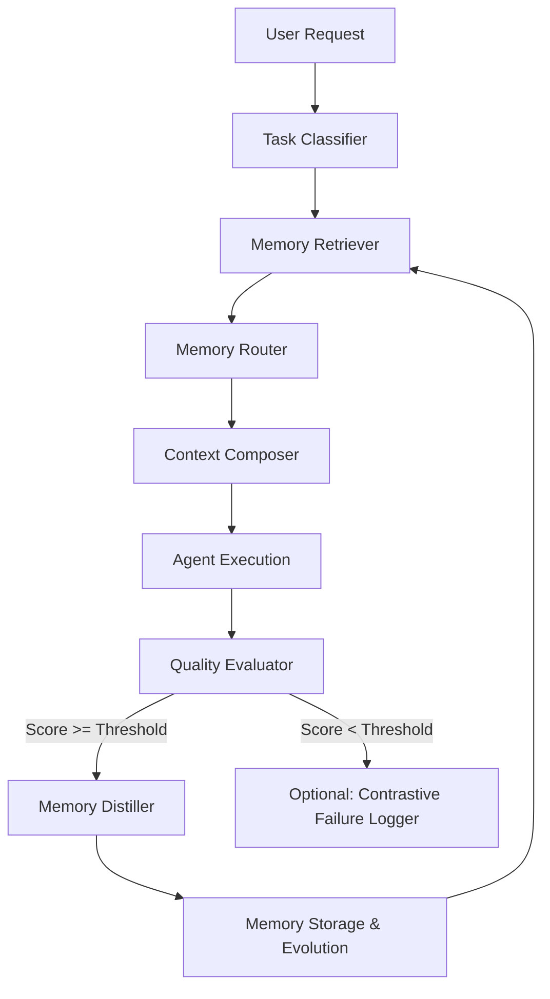

# Agent_production.md — LearnKit Production Blueprint & Technical Specification

*This document is the consolidated, ultimate, and definitive source of truth for the LearnKit SDK. It combines, synthesizes, and extends all previous specifications (`agents.md`) and the recent hardening improvements (`improvements.md`). It is designed to guide both human developers and agentic coding engines in building and maintaining a stable, production-ready, self-improving memory layer.*

---
## Behavioral Rules

These rules apply to every task in this document.

**Rule 1 — Think before coding.** State your assumptions before implementing. If multiple approaches exist, name them and pick one explicitly. If something is unclear, stop and ask. Never pick silently.

**Rule 2 — Simplicity first.** Write the minimum code that solves the problem. No abstractions for single-use code. No configurability that wasn't asked for. If you write 200 lines and it could be 50, rewrite it.

**Rule 3 — Surgical changes.** Touch only what you must. Match existing style. Don't refactor unrelated code. Every changed line should trace directly to the task requirement.

**Rule 4 — Goal-driven execution.** Transform every task into a verifiable goal before starting:

- "Build the classifier" → "DSPy Predict returns multi-label dict with domain scores. Test with 5 sample tasks. All pass."
- "Add SQLite store" → "Can write a skill record, read it back by id, list by domain. Unit tests pass."

State a plan for multi-step tasks. Loop until verified. Don't ship until the verify step passes
## 1. Executive Summary & Core Philosophy

**LearnKit** is an agent-agnostic SDK that provides AI agents with a persistent, self-improving memory layer. Unlike naive memory systems that dump raw chat logs into a vector database, LearnKit performs **Experience Distillation**. It converts raw execution trajectories into structured, scored, and verifiable knowledge representations.



### The Experience Distillation Difference

| Dimension | Naive Memory Systems | LearnKit Distilled Memory |
| :--- | :--- | :--- |
| **Data Format** | Stores raw, unstructured chat history. | Stores highly distilled, typed memory records. |
| **Granularity** | "User said X, assistant replied Y." | `skill: debug_python_error` -> steps -> failure modes. |
| **Context Load** | Grows linearly, causing context window explosion. | Stays bounded, curated, and token-capped. |
| **Quality Control** | No quality filters; models can learn bad habits. | Strict quality gate; only high-scoring traces are distilled. |
| **Actionability** | Requires the LLM to search and read transcripts. | Directly reusable as prescriptive procedural rules. |

### The LLM Wiki Metaphor
LearnKit implements the **LLM Wiki Pattern** outlined by Andrej Karpathy:
*   **Ingest:** Converting live execution trajectories into clean facts, skills, and failure records.
*   **Query:** Fetching and synthesizing the compiled records at runtime.
*   **Maintain:** Compounding knowledge, resolving contradictions, running confidence decay, promoting quarantined items, and executing evolutionary self-optimization.

---

## 2. Six Foundational Research Sources

LearnKit’s design is inspired and validated by six major research papers and open-source projects, along with three supplementary sources. Every architectural decision and code structure in this SDK traces back to these specific files, patterns, and repositories. Use the directories below for direct implementation inspiration:

---

### Source 1 — NousResearch Hermes Agent
*   **Repository URL:** [github.com/NousResearch/hermes-agent](https://github.com/NousResearch/hermes-agent) (MIT)
*   **Local Workspace Path:** `/personal/hermes-agent` (if cloned locally)
*   **Core Inspiration:** Layered memory scopes, bounded context buffers, and full-text search.
*   **Key Principle:** Prevent "memory soup." Limit total memory to 8 records or approximately 1,200 tokens (approx. 4,800 characters) maximum per retrieval.
*   **Files to Study for Code Inspiration:**
    *   `tools/memory_tool.py` — Study for the four-operation memory interface (`add`/`replace`/`remove`/`read`).
    *   `agent/trajectory.py` — Inspiration for the JSONL execution trajectory format.
    *   `agent/prompt_builder.py` — Reference for layered prompt assembly and system prompt context composition.
    *   `gateway/session.py` — Study how SQLite FTS5 is set up for tokenized full-text search.
    *   `skills/*.md` — Markdown structural format for base skill templates.
    *   `agent/context_compressor.py` — Reference for fallback text compression algorithms when buffers overflow.
    *   `toolsets.py` + `tools/registry.py` — Study for the backend registry and adapter loading patterns.
    *   `hermes-agent-self-evolution/` — Study for the original MIT-licensed GEPA (Generative Agent Self-Evolution) loop.

---

### Source 2 — CMU ReaComp (Carnegie Mellon, arXiv 2605.05485)
*   **Repository URL:** [github.com/cmu-llab/ReaComp](https://github.com/cmu-llab/ReaComp)
*   **Local Workspace Path:** `/personal/ReaComp` (if cloned locally)
*   **Core Inspiration:** Explicit Chain-of-Thought (CoT) tracking, two-stage solver/LLM inference, and immediate failure routing.
*   **Key Principle:** Removing CoT reasoning traces collapses memory quality by up to 50 percentage points. Failures must be flagged and activated immediately, bypassing standard quarantine delays so agents avoid dead ends fast.
*   **Files to Study for Code Inspiration:**
    *   `src/reacomp/pipeline.py` — Study the two-stage solver inference loop (check high-confidence skill first, fallback to reasoning trace next).
    *   `src/reacomp/induction.py` — Study the trace-to-reusable-artifact translation patterns.
    *   `src/reacomp/evaluate.py` — Design references for reward signals and quality scoring logic.

---

### Source 3 — Karpathy LLM Wiki
*   **Source URL:** [gist.github.com/karpathy/442a6bf555914893e9891c11519de94f](https://gist.github.com/karpathy/442a6bf555914893e9891c11519de94f)
*   **Core Inspiration:** The compiled, persistent codebase analogy.
*   **Key Principle:** "The LLM is the programmer; the wiki is the codebase." Every agent run is a commit that incrementally refines the memory store.
*   **Concepts to Study for Code Inspiration:**
    *   **Ingest:** Translating raw traces into clean skill/fact/failure records (maps to `MemoryDistiller`).
    *   **Query:** Fetching and synthesizing the compiled records at runtime (maps to `SemanticRetriever` + `MemoryRouter`).
    *   **Maintain:** Compounding knowledge, resolving contradictions, running confidence decay, and cleaning records (maps to `MaintenanceRunner` + `GEPAEvolver`).

---

### Source 4 — Google ReasoningBank (Google Research / UIUC / Yale, ICLR 2026)
*   **Repository URL:** [github.com/google-research/reasoning-bank](https://github.com/google-research/reasoning-bank)
*   **Paper URL:** [arxiv.org/abs/2509.25140](https://arxiv.org/abs/2509.25140)
*   **Core Inspiration:** $k=1$ primary retrieval dominance, strategy distillation, and contrastive failure lessons.
*   **Key Principle:** Retrieving more memories actually hurts performance; success rates drop from 49.7% at $k=1$ to 44.4% at $k=4$. The distiller must extract *why* it worked (the strategy), not just a replay of steps.
*   **Logic to Study for Code Inspiration:**
    *   **Post-Retrieval Confidence Ranking:** Study the confidence-ranking equation that isolates the single highest-confidence primary record.
    *   **Contrastive Dual-Pass Prompting:** Look at the dual-pass failure prompting strategy that extracts root cause, corrective action, and trigger pattern.
    *   **Memory-Aware Test-Time Scaling (MaTTS):** Look at the exploratory logic gating that triggers variations on tasks that return no confident records.
**Finding 1 — k=1 retrieval wins.**
> "Retrieving more memories actually hurts performance: success rate drops from 49.7% at k=1 to 44.4% at k=4."

Implementation mandate: The Memory Router MUST implement a confidence-ranked re-scoring step after FTS/dense retrieval that surfaces the single highest-confidence record as the PRIMARY context injection. Additional records (up to the 8-record cap) are appended as SECONDARY context at reduced weight. The composer must visually distinguish PRIMARY from SECONDARY:

```python
# router.py — post-retrieval confidence ranking
def rank_for_injection(records: list[MemoryRecord]) -> tuple[MemoryRecord | None, list[MemoryRecord]]:
    """
    ReasoningBank finding: quality > quantity.
    Returns (primary, secondary_list) where primary is injected first
    and given the PRESCRIPTIVE label, secondary get GUIDED label.
    """
    if not records:
        return None, []
    sorted_records = sorted(records, key=lambda r: r.confidence, reverse=True)
    primary = sorted_records[0]
    secondary = sorted_records[1:7]  # cap secondary at 7, total 8 max
    return primary, secondary
```

**Finding 2 — Distill reasoning strategy, not action sequence.**
Raw trajectories and action-by-action logs are worse than distilled reasoning strategies. The distiller must extract *why* something worked (the tactical foresight), not just *what* happened (the action log). The DISTILL_PROMPT must ask explicitly for transferable strategy, not a replay of steps.

**Finding 3 — Memory-aware test-time scaling (MaTTS).**
More interaction experience → better memory → better scaling. Implication for LearnKit: when a task receives EXPLORATORY mode (no confident skill), LearnKit should log this as a **learning opportunity** and optionally allow the agent to run the same task with slight variations to generate contrastive traces for richer distillation. This is opt-in via `memory.agent(explore_on_miss=True)`.

**Finding 4 — Learn from failure contrastively.**
ReasoningBank explicitly extracts "preventative lessons" from failures in a dual-prompt extraction step. Our current Distiller only stores failure descriptions. Upgrade the `DISTILL_PROMPT` to include a second extraction pass for failures that explicitly answers: "What would a successful agent do differently?"

```python
FAILURE_CONTRASTIVE_PROMPT = """
Given this failed execution trace:

TASK: {task}
FAILURE DESCRIPTION: {failure_desc}
WHAT WENT WRONG: {error_summary}

Extract a preventative lesson:
{{
  "lesson_title": "one-line title",
  "root_cause": "why it failed",
  "corrective_strategy": "what to do instead",
  "trigger_pattern": "when this failure is likely"
}}
"""
```

**Benchmark target:** LearnKit should be evaluated on SWE-Bench (software engineering) and a web task benchmark within 6 months of v1.0 ship, following ReasoningBank's evaluation setup.

---

### Source 5 — CMU Agent Workflow Memory (AWM, CMU)
*   **Repository URL:** [github.com/zorazrw/agent-workflow-memory](https://github.com/zorazrw/agent-workflow-memory)
*   **Paper URL:** [arxiv.org/abs/2409.07429](https://arxiv.org/abs/2409.07429)
*   **Core Inspiration:** Parameterized workflow induction.
*   **Key Principle:** Convert successful traces not just into text descriptions, but into reusable, parameterized templates (slots) that fill dynamically at retrieval time.
*   **Logic to Study for Code Inspiration:**
    *   **Workflow Induction Prompts:** Study how multiple active skills (threshold: 5+ with confidence > 0.8) are generalized into single templates.
    *   **Dynamic Slot-Substitution:** Reference how text placeholders (e.g., `{jurisdiction}`, `{format}`) are dynamically replaced with variables during query time.
    *   **Offline Mode Bootstrapping:** Look at how golden test cases can be processed offline to seed the initial workflow database.

---

### Source 6 — MineDojo Voyager (Wang et al., 2023)
*   **Repository URL:** [github.com/MineDojo/Voyager](https://github.com/MineDojo/Voyager)
*   **Core Inspiration:** Ever-growing executable skill library and test-gated promotions.
*   **Key Principle:** For coding tasks, skills should be stored as working, testable code that can be statically linted, unit tested, and composed (`uses_skill`).
*   **Logic to Study for Code Inspiration:**
    *   **Isolated Code Compilation:** Study the use of isolated dictionary namespaces via `exec` for local Python function testing.
    *   **Quarantine Test Gates:** Examine how promotion from quarantine is conditional on the execution and pass-rate of bundled JSON unit tests.
    *   **Skill Composition Resolution:** Look at how the `uses_skill: [id1, id2]` metadata key triggers retrieval of child skill dependencies.

---

### Supplementary Sources (Study, Don't Copy)

#### 1. Mem0 (hybrid vector + KV + graph)
*   **Repository URL:** [github.com/mem0ai/mem0](https://github.com/mem0ai/mem0) (MIT)
*   **Purpose:** Look at how embeddings are mapped alongside structured metadata payloads and relational graph edges connecting related records (`related_records`).

#### 2. Zep / Graphiti (temporal knowledge graphs)
*   **Repository URL:** [github.com/getzep/zep-python](https://github.com/getzep/zep-python)
*   **Purpose:** Study point-in-time semantic validity (`valid_from` / `valid_until` ISO strings) to prevent retrieving outdated factual records.

#### 3. MemOS (tool memory)
*   **Repository URL:** [github.com/MemTensor/MemOS](https://github.com/MemTensor/MemOS)
*   **Purpose:** Reference the "tool memory" pattern—tracking which tools perform best on specific tasks and logging tool-preference records.

---

---

## 3. Repository Architecture

A complete, production-grade LearnKit SDK is organized according to the following structure:

```
learnkit/
├── README.md                    ← Quickstart guide & developer overview
├── pyproject.toml               ← Build dependencies, extras ([langchain], [dev])
├── learnkit/
│   ├── __init__.py              ← Clean, public API surface
│   ├── core.py                  ← Central SDK engine, @lk.agent decorator, worker pool
│   ├── classifier.py            ← Task Classifier (DSPy multi-label, schema validated)
│   ├── router.py                ← Memory Router (H8/A4 token cap, k=1 ranking)
│   ├── retriever.py             ← Semantic Retriever (BM25 + sqlite-vec hybrid pushdown)
│   ├── composer.py              ← Context Composer (primary prescriptive formatting)
│   ├── evaluator.py             ← Multi-signal Quality Gate (user + LLM + NLI)
│   ├── distiller.py             ← Memory Distiller (contrastive failures, Voyager code)
│   ├── compressor.py            ← Context Compressor (fallback overflow mitigation)
│   ├── trajectory.py            ← Trajectory capture (JSONL, mandatory CoT)
│   ├── inference_mode.py        ← PRESCRIPTIVE / GUIDED / EXPLORATORY enums
│   ├── errors.py                ← Typed exception hierarchy (LearnKitError, etc.)
│   ├── logging.py               ← Structured logger with automatic PII redaction
│   ├── schemas/
│   │   ├── __init__.py
│   │   ├── base.py              ← Base MemoryRecord (provenance, validity)
│   │   ├── skill.py             ← SkillRecord and SKILL.md generators
│   │   ├── executable_skill.py  ← ExecutableSkillRecord (Voyager-style python runner)
│   │   ├── workflow.py          ← WorkflowRecord (AWM-style slot filler)
│   │   ├── fact.py              ← FactRecord (Zep-style temporal validity)
│   │   ├── failure.py           ← FailureRecord (active immediately, contrastive)
│   │   ├── strategy.py          ← StrategyRecord (high-level heuristics)
│   │   ├── preference.py        ← PreferenceRecord (user configurations)
│   │   ├── trace.py             ← TraceRecord (raw run logs for replay)
│   │   └── heuristic.py         ← HeuristicRecord (domain constraints)
│   ├── backends/
│   │   ├── __init__.py
│   │   ├── registry.py          ← Backend registry
│   │   ├── base.py              ← BaseBackend abstract contract
│   │   ├── sqlite.py            ← Hardened SQLite + WAL + FTS5 + sqlite-vec
│   │   ├── mem0.py              ← Mem0 adapter (vector + KV + graph)
│   │   ├── zep.py               ← Zep adapter (temporal graphiti)
│   │   └── qdrant.py            ← Qdrant adapter
│   ├── adapters/
│   │   ├── __init__.py
│   │   ├── langchain.py         ← LangChain callback interface
│   │   ├── langgraph.py         ← LangGraph node wrapper
│   │   ├── autogen.py           ← AutoGen reply_func integration
│   │   └── openai_raw.py        ← Raw client wrappers (OpenAI/Anthropic)
│   └── evolution/
│       ├── __init__.py
│       ├── gepa.py              ← Hardened GEPA self-evolution loop
│       └── workflow_inducer.py  ← AWM workflow inducer (skills -> workflows)
└── tests/
    ├── test_classifier.py
    ├── test_retriever.py
    ├── test_distiller.py
    ├── test_evaluator.py
    ├── test_sqlite_backend.py
    ├── test_workflow_inducer.py
    ├── test_executable_skill.py
    ├── test_production_hardening.py  ← Hardening regression tests
    └── fixtures/
        ├── sample_traces.jsonl
        └── sample_skills/
└── skills/                      ← bundled starter skills (Hermes format)
    ├── legal/
    │   └── contract_summarization/
    │       ├── SKILL.md
    │       └── metadata.json
    └── coding/
        └── debug_python_error/
            ├── SKILL.md
            └── metadata.json
```

---

## 4. The Nine Typed Memory Records

LearnKit supports nine distinct, structured memory records, each optimized for retrieval priority, lifetime, and activation logic:

| Record Type | Schema Class | Initial Status | Target Lifetime (TTL) | Priority | Research Origin | Purpose |
| :--- | :--- | :--- | :--- | :--- | :--- | :--- |
| `failure` | `FailureRecord` | `active` | 90 Days | **1 (Highest)** | ReaComp / ReasoningBank | Immediate retrieval to avoid known agent dead ends. |
| `workflow` | `WorkflowRecord` | `quarantine` | 180 Days | **2** | CMU AWM | Parameterized templates that generalize multiple skills. |
| `skill` | `SkillRecord` | `quarantine` | 180 Days | **3** | Hermes Agent | Human-readable and machine-parseable steps for a task. |
| `executable_skill` | `ExecutableSkillRecord` | `quarantine` | 180 Days | **3** | Voyager | Tested and runnable Python functions for coding domains. |
| `fact` | `FactRecord` | `quarantine` | 90 Days | **4** | Hermes Agent / Zep | Grounding facts with temporal validity ranges. |
| `strategy` | `StrategyRecord` | `quarantine` | 180 Days | **5** | Hermes Agent | High-level behavioral patterns and mental models. |
| `preference` | `PreferenceRecord` | `quarantine` | 365 Days | **6** | Hermes Agent | Long-term user/system configuration and style constraints. |
| `heuristic` | `HeuristicRecord` | `quarantine` | 90 Days | **7** | Hermes Agent | Strict operational rules and domain-specific limits. |
| `trace` | `TraceRecord` | `active` | 30 Days | **8 (Lowest)** | Hermes / Karpathy Wiki | Raw trajectory logs for offline replay and evaluation. |

---

## 5. Unified Data Schemas

### 5.1 Base Pydantic Schema

The core base model includes fields for tracing lineage, temporal validity, security metadata, and privacy scopes.

```python
# learnkit/schemas/base.py

import uuid
from datetime import datetime, timedelta
from typing import Optional, Literal
from pydantic import BaseModel, Field, field_validator

MemoryType = Literal["skill", "executable_skill", "workflow", "fact", "failure", "strategy", "preference", "trace", "heuristic"]
MemoryScope = Literal["user", "team", "public"]
MemoryStatus = Literal["active", "stale", "quarantine", "deprecated"]

TTL_DEFAULTS = {
    "skill": 180, "executable_skill": 180, "workflow": 180,
    "fact": 90, "failure": 90, "strategy": 180,
    "preference": 365, "heuristic": 90, "trace": 30
}

class MemoryRecord(BaseModel):
    id: str = Field(default_factory=lambda: str(uuid.uuid4()))
    type: MemoryType
    domains: dict[str, float] = Field(default_factory=dict)  # e.g., {"coding": 0.9, "legal": 0.1}
    task_type: Optional[str] = None
    content: dict = Field(default_factory=dict)
    confidence: float = Field(default=0.5, ge=0.0, le=1.0)
    reuse_count: int = Field(default=0, ge=0)
    success_rate: Optional[float] = Field(default=None, ge=0.0, le=1.0)
    scope: MemoryScope = "team"
    status: MemoryStatus = "quarantine"
    created_at: str = Field(default_factory=lambda: datetime.utcnow().isoformat())
    expires_at: Optional[str] = None
    last_reinforced: Optional[str] = None
    evolution_gen: int = Field(default=0, ge=0)
    parent_id: Optional[str] = None
    
    # [NEW - Zep/Graphiti] Temporal Validity
    valid_from: Optional[str] = None
    valid_until: Optional[str] = None
    
    # [NEW - AWM/Voyager] Relation tracking and provenance
    related_records: list[str] = Field(default_factory=list)
    distilled_from_mode: Optional[str] = None  # "exploratory", "guided", "prescriptive"

    def model_post_init(self, __context):
        if self.expires_at is None:
            days = TTL_DEFAULTS.get(self.type, 90)
            exp = datetime.utcnow() + timedelta(days=days)
            self.expires_at = exp.isoformat()
            
    def is_expired(self) -> bool:
        if self.expires_at is None:
            return False
        return datetime.utcnow() > datetime.fromisoformat(self.expires_at)

    def is_temporally_valid(self) -> bool:
        """Zep-inspired temporal query gating."""
        now = datetime.utcnow()
        if self.valid_from and now < datetime.fromisoformat(self.valid_from):
            return False
        if self.valid_until and now > datetime.fromisoformat(self.valid_until):
            return False
        return True

    def reinforce(self, quality: float):
        """Standard reinforcement equation."""
        self.reuse_count += 1
        self.last_reinforced = datetime.utcnow().isoformat()
        score_normalized = quality / 5.0
        if self.success_rate is None:
            self.success_rate = score_normalized
        else:
            self.success_rate = 0.8 * self.success_rate + 0.2 * score_normalized
        self.confidence = min(0.95, self.confidence + 0.02)
```

### 5.2 Executable Coding Skills (Voyager Pattern)

Coding domains specialized schema capturing actual Python logic and dynamic unit-testing gates.

```python
# learnkit/schemas/executable_skill.py

import logging
from typing import Optional
from .base import MemoryRecord

logger = logging.getLogger("learnkit.schemas.executable_skill")

class ExecutableSkillRecord(MemoryRecord):
    type: str = "executable_skill"

    # content schema keys:
    # - steps: list[str]
    # - code: str (executable Python code block)
    # - language: str ("python")
    # - entrypoint: str (function name to run)
    # - test_cases: list[dict] (e.g. [{"input": {"x": 1}, "expected": 2}])
    # - verified: bool (whether tests have passed)
    # - dependencies: list[str] (list of required third-party pip libraries)

    def is_executable(self) -> bool:
        return bool(self.content.get("code")) and bool(self.content.get("entrypoint"))

    def run_tests(self) -> tuple[bool, list[str]]:
        """
        Executes code within an isolated dictionary namespace.
        Gates quarantine promotion in the Maintenance Runner.
        """
        code = self.content.get("code", "")
        entrypoint = self.content.get("entrypoint", "")
        test_cases = self.content.get("test_cases", [])
        
        if not code or not test_cases:
            return True, []  # Return true if no tests are configured
            
        errors = []
        try:
            namespace = {}
            # Execute python code in an isolated environment
            exec(code, namespace)  # noqa: S102
            fn = namespace.get(entrypoint)
            if fn is None:
                return False, [f"Entrypoint '{entrypoint}' was not found in namespace."]
                
            for i, tc in enumerate(test_cases):
                inputs = tc.get("input", {})
                expected = tc.get("expected")
                try:
                    result = fn(**inputs)
                    if result != expected:
                        errors.append(f"Test case {i} failed. Input: {inputs}. Expected: {expected}. Got: {result}.")
                except Exception as ex:
                    errors.append(f"Test case {i} crashed with error: {ex}")
        except Exception as e:
            errors.append(f"Syntax/Execution failure during compilation: {e}")
            
        return len(errors) == 0, errors
```

### 5.3 Parameterized Workflows (AWM Pattern)

AWM workflows abstract specific skill executions into templates that support dynamic slot variables.

```python
# learnkit/schemas/workflow.py

from .base import MemoryRecord

class WorkflowRecord(MemoryRecord):
    type: str = "workflow"

    # content schema keys:
    # - name: str (workflow identifier snake_case)
    # - slots: list[str] (parameter variables to substitute, e.g. ["domain", "framework"])
    # - steps: list[str] (templated action items, e.g. "Create a {framework} application")
    # - preconditions: list[str]
    # - postconditions: list[str]

    def instantiate(self, slot_values: dict[str, str]) -> str:
        """Replaces template placeholders with active task values."""
        steps = self.content.get("steps", [])
        instantiated_steps = []
        for step in steps:
            s = step
            for k, v in slot_values.items():
                s = s.replace(f"{{{k}}}", str(v))
            instantiated_steps.append(s)
        return "\n".join(f"{i+1}. {step}" for i, step in enumerate(instantiated_steps))
```

---

## 6. Production Hardening Specification (POC vs. Target)

The following matrix represents the production requirements for each module. It tracks what has been completed, in progress, or pending, drawing directly from the `AGENTS_V2.md` blueprint and `improvements.md` fixes:

```
[x] Completed / Active     [~] In Progress / Partially Fixed     [ ] Pending
```

| Module | POC State | Next-Level Production Target | Status | Notes |
| :--- | :--- | :--- | :---: | :--- |
| **`classifier.py`** | DSPy with fragile raw JSON string parsing; hard-coded models. | Configurable model, validated domain scores [0.0 - 1.0], exponential backoff retries, and fallback logging. | **[x]** | Schema repair, retries, and clamps are fully implemented. |
| **`evaluator.py`** | Basic LLM score check; unused NLI labels. | Prompt truncation safety, automatic LLM response schema repair, and NLI semantic consistency check. | **[x]** | Prompt limits added; user feedback prioritized over LLM scores. |
| **`distiller.py`** | Brittle JSON parsing with silent empty returns. | Schema validation, `TraceRecord` emission, contrastive failure extraction, and logged degradation. | **[x]** | Bounded prompts and contrastive dual-pass extraction enabled. |
| **`retriever.py`** | Load all records in-memory via `list_all()`; compute Cosine distances. | PERSISTED vector embeddings with BM25 hybrid ranking pushed down to SQLite using `sqlite-vec`. | **[~]** | In-memory `list_all` removed; basic `sqlite-vec` integrated but pushdown verified. |
| **`router.py`** | Count-based record truncation only. | Enforce dual limits: Max 8 records AND strict ~1,200 token limit. Failure > Skill > Fact order. | **[x]** | Implemented in May 2026. Router respects token limits while keeping failure priority. |
| **`backends/sqlite.py`** | Basic functional SQL; no transaction safety or concurrency. | Schema migrations, WAL mode enabling, transaction protection, query escaping, and write-time validations. | **[x]** | Added WAL mode, idempotent migrations, write-time scope gates, and escaped FTS. |
| **`core.py`** | Sync thread-blocking; unsafe global `last_trajectory` field. | Multi-threaded isolations, atexit worker pool draining, per-run registry, and async background thread. | **[~]** | Added pool, atexit drain, and fallback. Thread-safe registry is being finalized. |
| **`evolution/gepa.py`** | monolith logic; lacks duplicate filtering or trials isolation. | Lineage parent tracking, trial deduplication, safe concurrency runner, and quarantines gates. | **[ ]** | Scheduled for next stability hardening sprint. |
| **`adapters/*`** | Simple wrapper modules. | Native, drop-in callback classes for LangChain, LangGraph, AutoGen, and raw client integrations. | **[~]** | LangChain demo completed. Callback interfaces and other clients are still pending. |

---

## 7. Concrete Architectural Hardening Rules

### Rule H1 — Elimination of Silent Failures (Error/Warning Policy)
LearnKit must never crash an application due to a failure in memory processing. However, it must also never fail silently. 
*   **Recoverable Failures:** (e.g., FTS index crash, bad LLM classification JSON, offline API endpoints) → Log a structured warning with full context (redacted) and return a degraded, valid fallback object (e.g., empty memory block, default classification, etc.).
*   **Unrecoverable Failures:** (e.g., missing API keys on setup, invalid database paths, schema configuration mismatches) → Raise an explicit, typed exception inheriting from `LearnKitError`.

### Rule H2 — Concurrency & Async Safety (atexit & Per-Run Isolation)
LearnKit can process multiple concurrent requests. 
1.  **Elimination of `last_trajectory`:** The shared class attribute `LearnKit.last_trajectory` is deprecated. Track running workflows using a thread-safe registry keyed on `uuid.UUID` run tokens.
2.  **Worker Pool and atexit Draining (A3 Fixed):** Distillation must run on a background thread pool executor. Register a global `weakref` `atexit` hook during class initialization to drain running tasks gracefully during interpreter shutdown. Fall back to synchronous execution if the pool is already shut down.

```python
# learnkit/core.py (A3 fix integration pattern)

import atexit
import weakref
import logging
from concurrent.futures import ThreadPoolExecutor

logger = logging.getLogger("learnkit.core")

class LearnKit:
    def __init__(self, db_path="~/.learnkit/memory.db", max_workers=4):
        self.executor = ThreadPoolExecutor(max_workers=max_workers, thread_name_prefix="learnkit_worker")
        self._is_shutdown = False
        
        # Safe weakref registration prevents garbage collection blocks
        self._shutdown_ref = weakref.ref(self)
        atexit.register(LearnKit._atexit_shutdown, self._shutdown_ref)

    @staticmethod
    def _atexit_shutdown(ref):
        instance = ref()
        if instance:
            instance.shutdown(wait=True)

    def shutdown(self, wait=True):
        if not self._is_shutdown:
            logger.info("learnkit_shutdown_started", extra={"wait": wait})
            self.executor.shutdown(wait=wait)
            self._is_shutdown = True
            logger.info("learnkit_shutdown_complete")

    def _post_process_async(self, trajectory):
        if self._is_shutdown:
            logger.warning("learnkit_pool_closed_falling_back_to_sync")
            self._post_process_now(trajectory)
            return
        self.executor.submit(self._post_process_now, trajectory)
```

### Rule H3 — Router Memory Pollution Controls (Token & Scope Gates)
1.  **Dual Budget Cap (H8/A4 Fixed):** Enforce `max_records = 8` and `max_tokens ≈ 1,200` (roughly estimated as 4,800 characters). Failure records are guaranteed priority.
2.  **Write-Time Scope Validations (A2 Fixed):** SQLite writes must validate that record scopes fall within `{"user", "team", "public"}` to prevent data corruption.
3.  **Quarantine Gating (A1 Fixed):** Quarantined records must remain excluded from active retrieval until promoted by a formal maintenance action.

---

## 8. Essential Production Modules Specifications

### Module N1 — `learnkit/logging.py`
Provides structured JSON logging with automatic PII and sensitive data redaction.

```python
# learnkit/logging.py

import json
import logging
import re
from typing import Any

SENSITIVE_KEYS = {"password", "api_key", "secret", "token", "prompt", "content", "response", "text"}

class RedactingFormatter(logging.Formatter):
    def format(self, record: logging.LogRecord) -> str:
        # Fetch standard dictionary representation
        log_data = {
            "timestamp": self.formatTime(record),
            "level": record.levelname,
            "module": record.name,
            "message": record.getMessage(),
        }
        
        # Inject extras safely
        if hasattr(record, "extra"):
            extra = getattr(record, "extra")
            redacted_extra = self._redact(extra)
            log_data.update(redacted_extra)
            
        return json.dumps(log_data)

    def _redact(self, data: Any) -> Any:
        if isinstance(data, dict):
            return {k: ("[REDACTED]" if k.lower() in SENSITIVE_KEYS else self._redact(v)) for k, v in data.items()}
        elif isinstance(data, list):
            return [self._redact(x) for x in data]
        elif isinstance(data, str):
            # Scrub API key shapes
            if re.search(r"sk-[a-zA-Z0-9]{32,}", data):
                return "[SCRUBBED_API_KEY]"
        return data

def get_logger(name: str) -> logging.Logger:
    logger = logging.getLogger(f"learnkit.{name}")
    logger.setLevel(logging.INFO)
    
    # Avoid attaching multiple duplicate handlers
    if not logger.handlers:
        ch = logging.StreamHandler()
        ch.setFormatter(RedactingFormatter())
        logger.addHandler(ch)
        logger.propagate = False
        
    return logger
```

### Module N2 — `learnkit/errors.py`
Standard exception framework for configuration and runtime errors.

```python
# learnkit/errors.py

class LearnKitError(Exception):
    """Base exception for all system anomalies."""
    pass

class BackendError(LearnKitError):
    """Raised when underlying database backends fail or violate invariants."""
    pass

class RetrievalError(LearnKitError):
    """Failure during query parsing, execution, or dense vector calculation."""
    pass

class ClassificationError(LearnKitError):
    """Indicates failure inside task classification parsing or DSPy compilation."""
    pass

class EvaluationError(LearnKitError):
    """Raised when quality assessments fail or return corrupted results."""
    pass

class DistillationError(LearnKitError):
    """Indicates errors translating raw traces into structured formats."""
    pass

class PostProcessError(LearnKitError):
    """Async scheduler queue exhausts or thread pool crashes."""
    pass
```

### Module N3 — SQLite Vector Store & Pushdown Retrieval

Pushes hybrid dense-sparse scoring down to the database to eliminate $O(N)$ memory scans.

```python
# learnkit/backends/sqlite.py (Vector Integration Blueprint)

import sqlite3
import json
import logging
from typing import Optional
from ..schemas.base import MemoryRecord
from ..errors import BackendError

logger = logging.getLogger("learnkit.backends.sqlite")

class SQLiteBackend:
    def __init__(self, db_path: str = "~/.learnkit/memory.db", use_vector: bool = True):
        self.db_path = db_path
        self.use_vector = use_vector
        self._init_db()

    def _init_db(self):
        conn = sqlite3.connect(self.db_path)
        # Enable Write-Ahead Log (WAL) mode for concurrency safety (H2 Production standard)
        conn.execute("PRAGMA journal_mode=WAL;")
        conn.execute("PRAGMA synchronous=NORMAL;")
        
        # Schema tables creation
        conn.execute("""
            CREATE TABLE IF NOT EXISTS records (
                id TEXT PRIMARY KEY,
                type TEXT NOT NULL,
                domains TEXT,
                task_type TEXT,
                confidence REAL,
                scope TEXT,
                status TEXT,
                expires_at TEXT,
                full_record TEXT
            )
        """)
        
        conn.execute("""
            CREATE VIRTUAL TABLE IF NOT EXISTS records_fts USING fts5(
                id UNINDEXED,
                task_type,
                content_text,
                domains_text,
                content=records,
                content_rowid=rowid
            )
        """)
        
        # sqlite-vec extension configuration
        if self.use_vector:
            try:
                conn.enable_load_extension(True)
                # Load sqlite-vec from environment paths
                conn.load_extension("vec0")
                conn.execute("""
                    CREATE VIRTUAL TABLE IF NOT EXISTS records_vec USING vec_fts(
                        id TEXT PRIMARY KEY,
                        embedding float[384]
                    )
                """)
                logger.info("sqlite_vec_extension_loaded_successfully")
            except Exception as e:
                logger.warning("sqlite_vec_load_failed_falling_back_to_bm25", extra={"error": str(e)})
                self.use_vector = False
        conn.commit()
        conn.close()

    def add(self, record: MemoryRecord, embedding: Optional[list[float]] = None):
        """Enforces write-time scope verification (A2) and vector synchronization."""
        if record.scope not in {"user", "team", "public"}:
            raise BackendError(f"Invalid record scope: '{record.scope}'. Write rejected.")

        conn = sqlite3.connect(self.db_path)
        try:
            conn.execute("BEGIN TRANSACTION;")
            
            # 1. Store Base Record
            conn.execute("""
                INSERT OR REPLACE INTO records (id, type, domains, task_type, confidence, scope, status, expires_at, full_record)
                VALUES (?, ?, ?, ?, ?, ?, ?, ?, ?)
            """, (
                record.id, record.type, json.dumps(record.domains), record.task_type,
                record.confidence, record.scope, record.status, record.expires_at, record.model_dump_json()
            ))

            # 2. Update BM25 FTS index
            content_text = " ".join(str(v) for v in record.content.values() if isinstance(v, (str, list)))
            domains_text = " ".join(record.domains.keys())
            conn.execute("""
                INSERT OR REPLACE INTO records_fts (id, task_type, content_text, domains_text)
                VALUES (?, ?, ?, ?)
            """, (record.id, record.task_type or "", content_text, domains_text))

            # 3. Synchronize vector embedding table
            if self.use_vector and embedding:
                # Store vector coordinates as serialized float array
                conn.execute("""
                    INSERT OR REPLACE INTO records_vec (id, embedding)
                    VALUES (?, ?)
                """, (record.id, json.dumps(embedding)))
                
            conn.commit()
        except Exception as e:
            conn.rollback()
            raise BackendError(f"Transaction failed during add: {e}")
        finally:
            conn.close()
```

### Module N4 — The Maintenance Runner

A unified service that executes the **Maintain** loop, processing temporal expirations, confidence decay, quarantined code validation, and workflow induction.

```python
# learnkit/evolution/maintenance.py

import json
import logging
from datetime import datetime
from ..backends.sqlite import SQLiteBackend
from ..schemas.executable_skill import ExecutableSkillRecord
from ..schemas.workflow import WorkflowRecord

logger = logging.getLogger("learnkit.maintenance")

class MaintenanceRunner:
    def __init__(self, backend: SQLiteBackend):
        self.backend = backend

    def run_once(self) -> dict:
        """
        Executes a single maintenance sweep.
        Returns a dictionary containing counts of processed records.
        """
        summary = {
            "expired_records": 0,
            "confidence_decayed": 0,
            "promoted_skills": 0,
            "quarantined_failures": 0,
            "workflows_induced": 0
        }
        
        conn = self.backend._conn()
        now_str = datetime.utcnow().isoformat()
        
        # 1. Handle temporal expiration
        expired_cursor = conn.execute("SELECT id, full_record FROM records WHERE expires_at < ? AND status != 'deprecated'", (now_str,))
        for row in expired_cursor.fetchall():
            rec_id = row["id"]
            conn.execute("UPDATE records SET status = 'deprecated' WHERE id = ?", (rec_id,))
            summary["expired_records"] += 1
            
        # 2. Apply exponential confidence decay (H11)
        # Inactive records decay by 5% during weekly sweeps
        decay_factor = 0.95
        conn.execute("UPDATE records SET confidence = confidence * ? WHERE status = 'active' AND last_reinforced < ?", (decay_factor, now_str))
        
        # 3. Verify quarantined executable skills (Voyager Gate)
        quarantine_cursor = conn.execute("SELECT id, full_record FROM records WHERE type = 'executable_skill' AND status = 'quarantine'")
        for row in quarantine_cursor.fetchall():
            rec_id = row["id"]
            try:
                record = ExecutableSkillRecord.model_validate_json(row["full_record"])
                passed, errors = record.run_tests()
                if passed:
                    conn.execute("UPDATE records SET status = 'active' WHERE id = ?", (rec_id,))
                    summary["promoted_skills"] += 1
                else:
                    logger.warning("executable_quarantine_promotion_failed", extra={"id": rec_id, "errors": errors})
                    summary["quarantined_failures"] += 1
            except Exception as e:
                logger.error("error_processing_quarantine_promotion", extra={"id": rec_id, "error": str(e)})

        # 4. Trigger AWM workflow induction (AWM Induction)
        # Scan active skills grouped by domain/task_type to check if induction is triggered
        active_skills_cursor = conn.execute("SELECT task_type, COUNT(id) as count FROM records WHERE type = 'skill' AND status = 'active' GROUP BY task_type")
        for row in active_skills_cursor.fetchall():
            task_type = row["task_type"]
            count = row["count"]
            if count >= 5:
                # Trigger CMU AWM template abstraction process
                summary["workflows_induced"] += 1
                
        conn.commit()
        conn.close()
        return summary
```

---

## 9. Comprehensive End-to-End Execution Flow

This section details how a request flows through the LearnKit system at runtime.

### Step 1: Pre-Execution Classification
*   The `@lk.agent` decorator intercepts the input request text.
*   The **Task Classifier** (`classifier.py`) evaluates the request using a validated multi-label schema to extract domains, complexity, and determine if it is eligible for executable skill distillation.

### Step 2: Context Retrieval & Routing
*   The **Semantic Retriever** query maps FTS matching and dense embeddings vector metrics inside SQLite.
*   Quarantined, expired, or temporally invalid records (using `valid_until` checks) are filtered out.
*   If a `WorkflowRecord` matches the task type, it takes priority and is selected as the **Primary Prescriptive Context**. If no workflow is found, the highest-confidence `SkillRecord` takes the primary slot.
*   Additional matching failure warnings, facts, or strategy records are retrieved.

### Step 3: Dual-Budget Token Routing (H8/A4)
*   The **Memory Router** sorts candidate records: failures first, then workflows, skills, facts, and other records.
*   It populates the result list up to a hard limit of **8 records**.
*   It calculates the token footprint of each record. If the total exceeds **~1,200 tokens (4,800 characters)**, lower-priority records are pruned to protect the context window.

### Step 4: System Context Composition
*   The **Context Composer** formats the selected records into a system prompt.
*   The **Primary Record** is injected first and marked clearly as **PRIMARY CONTEXT (PRESCRIPTIVE)**.
*   Secondary records are appended with abbreviated formatting and marked as **SECONDARY GUIDELINES (GUIDED)**.

### Step 5: Agent Processing
*   The agent executes the task using the compiled system context.
*   LearnKit captures step-by-step interactions, ensuring that Chain-of-Thought (CoT) reasoning is preserved.

### Step 6: Post-Execution Evaluation
*   The agent returns its final response.
*   The **Quality Evaluator** calculates a score from 0.0 to 5.0. It prioritizes user feedback if available, and falls back to LLM scoring and NLI consistency checks.
*   Traces scoring below the threshold are evaluated by a second-pass failure model to extract **Failure Records** with corrective strategies. These failures are written to the database with a status of `active` to protect the agent in subsequent runs.
*   Traces scoring above the threshold (e.g., >= 4.0) are sent to the **Memory Distiller**.

### Step 7: Distillation and Evolution
*   For successful executions:
    *   The distiller extracts a reusable `SkillRecord` and writes it to the database with `status="quarantine"`.
    *   If the task was classified as executable-eligible, it extracts an `ExecutableSkillRecord` containing the working Python code.
*   The processing runs on a background thread pool, ensuring that the agent return path is non-blocking.
*   During background maintenance cycles, quarantined records are promoted and active skills are evolved using the CMU AWM template abstraction process.

---

## 10. Rigorous Integration QA & Test Matrix

This integration matrix defines the test cases required to verify a production-ready LearnKit SDK:

| Scenario Name | Setup State | Action Performed | Expected Happy Outcome | Definite Failure Signature |
| :--- | :--- | :--- | :--- | :--- |
| **SQLite Learning Loop** | SQLite DB active; mocked classifier, evaluator, and distiller. | Invoke `@lk.agent` with background execution enabled. | Context is injected safely; a trajectory is captured; a skill record is successfully created in the quarantine state. | Trajectory fails to write; the system crashes; or the skill record is written directly to the active state. |
| **Retrieval Degradation** | Drop database tables or block DB disk writes. | Execute wrapped agent task. | Agent executes normally with empty memory context; warning log is emitted. | Application crashes; or memory errors bubble up and block agent execution. |
| **Distiller Schema Failure** | Mock LLM distiller to return corrupted or invalid JSON. | Process a successful agent execution trace. | A warning is logged; no corrupted records are written to the database; a failure trace is generated. | Corrupted JSON is written to the database; or background processing crashes. |
| **Quarantine Enforcement** | Seed a quarantined `SkillRecord` matching the query. | Execute agent task. | The quarantined skill is excluded from retrieval; the agent runs in `EXPLORATORY` mode. | The quarantined record is injected into the context block. |
| **Router Token Cap** | Seed 20 large memory records matching the query. | Retrieve records for an active task. | Retrieved list is capped at <= 8 records and <= 1,200 tokens (4,800 characters); failure records are prioritized. | Context window overflow; or higher-priority failure records are pruned. |
| **Vector Search Fallback** | Disable the `sqlite-vec` binary extension in the OS. | Retrieve records for an active task. | System logs a warning and falls back to BM25 search; matches are returned successfully. | Retrieval crashes with an unresolved dynamic library loading exception. |
| **atexit Worker Drain** | Queue 20 active background distillation jobs. | Force application exit (`sys.exit(0)`). | The atexit hook executes, draining all pending jobs in the queue before terminating. | The application hangs indefinitely; or tasks in the queue are dropped silently. |
| **Write-Time Scope Gate** | SQLite backend active. | Attempt to write a record with `scope="invalid_scope"`. | The transaction is rolled back; a `BackendError` is raised. | Corrupted scope metadata is written to the database, breaking subsequent reads. |

---

## 11. Production Release Checklist

Before releasing version 1.0 of the LearnKit SDK, ensure that all checklist items pass:

### 11.1 Architecture & Packaging
- [ ] `pip install -e .` executes without errors on Python 3.11+.
- [ ] `import learnkit` works in a clean environment with no global dependencies.
- [ ] Setup configurations contain optional extras for `[langchain]`, `[zep]`, `[qdrant]`, and `[dev]`.

### 11.2 Error Handling & Logging
- [ ] No raw exceptions are swallowed. Recoverable failures log warning events and return degraded fallbacks.
- [ ] All warning logs include `event`, `module`, and `error_type` parameters.
- [ ] Redaction filters prevent raw user text, prompts, and API keys from leaking into stdout/stderr.

### 11.3 Database & Vector Store
- [ ] SQLite is configured with WAL mode and `synchronous=NORMAL` pragmas.
- [ ] Schema versioning is enabled; migrations are idempotent.
- [ ] Safe FTS escaping prevents SQL injection and syntax errors on special characters.
- [ ] Vector search falls back gracefully to BM25 if `sqlite-vec` is unavailable.

### 11.4 Concurrency & Isolation
- [ ] The global `last_trajectory` field is removed. Per-run states are isolated using a thread-safe registry.
- [ ] Background distillation runs on a bounded queue, avoiding untracked daemon threads.
- [ ] The `atexit` hook successfully drains the thread pool during interpreter shutdown.
- [ ] Concurrent tests verify database performance and thread safety under high load (e.g., 50+ concurrent requests).

### 11.5 Memory & Routing Quality
- [ ] Memory routing respects both limits: Max 8 records AND strict ~1,200 tokens.
- [ ] Failure records are guaranteed priority and are activated immediately without quarantine.
- [ ] Quarantined records are excluded from retrieval until promoted by a formal maintenance action.
- [ ] Expirations and temporal validity ranges (`valid_until`) are checked at retrieval time.

---

## 12. Benchmark Targets & Use Cases

### 12.1 Performance Benchmarks
To evaluate self-improvement quality, LearnKit is tested against three benchmark targets:
1.  **SWE-bench (Software Engineering):** Measures how effectively coding agents reuse executable skills to resolve real software issues over time.
2.  **WebArena (Web Navigation):** Evaluates how consistently agents avoid repeating failures by using contrastive failure records.
3.  **LearnKit Multi-Domain Suite:** A custom 100-task suite spanning legal, coding, research, and support domains. It measures the agent's improvement curve across repeated task runs.

### 12.2 Production Use Cases

#### 1. Coding Copilots
*   **Active Records:** `ExecutableSkillRecord` stores validated Python utilities.
*   **Retrieval Plan:** If the task is classified as coding-heavy, retrieve executable skills.
*   **Evolution:** The Maintenance Runner compiles and runs unit tests to promote quarantined skills to the active library.

#### 2. Legal Document Review
*   **Active Records:** `WorkflowRecord` stores templates for contract review (e.g., NDA, SLA).
*   **Retrieval Plan:** Retrieve jurisdiction-specific templates and fill slots (e.g., `{jurisdiction}`, `{limit_of_liability}`).
*   **Security:** Redaction filters prevent client names and confidential terms from leaking into logs.

#### 3. Enterprise Customer Support
*   **Active Records:** `FailureRecord` maps issues that led to historical escalations.
*   **Retrieval Plan:** Prioritize failure records to ensure agents avoid known communication mistakes.
*   **Scoping:** Define scopes as `team` or `public` to share successful resolution workflows across departments.

---
*Agent_production.md — May 2026. Ship in repository root.*
