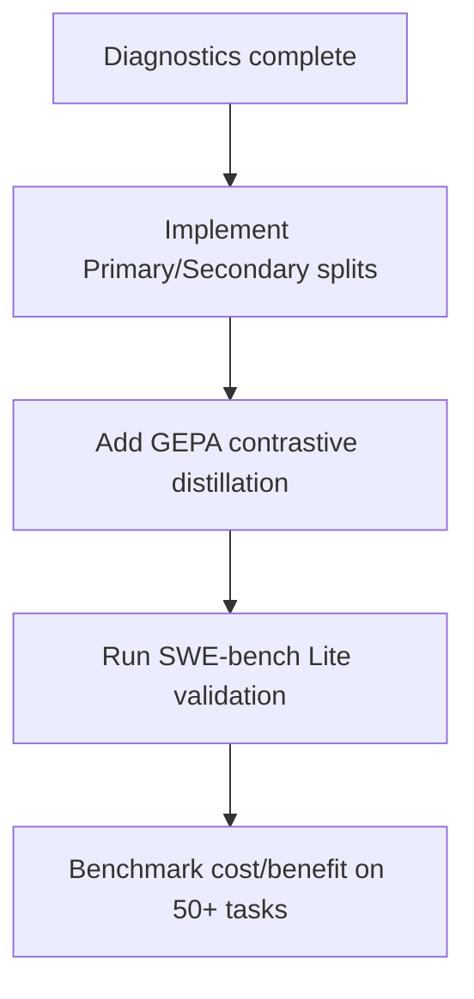

# LearnKit Debugging & System Improvements Report

This report analyzes the core failure modes, retrieval friction points, and quality bottlenecks identified across the PBE, SLR, SQL, Python Debugging, and SWE-bench Lite benchmarks. It outlines concrete technical proposals to refine LearnKit for production-grade agent architectures.

---

## 1. Diagnostics & Key Gaps

### A. The "Exploratory" Plateau (SWE-bench & Complex Python)
* **Symptom**: In online cold-start runs, scores on complex tasks (e.g., pytest skip and assertion rewriting) plateaued around `2.4 / 5.0`.
* **Root Cause**: If a task is too complex for the base LLM to resolve zero-shot, it never reaches a score of $\ge 3.5$. Consequently, the distiller never generates positive **Skills** (`prescriptive mode`). It only generates **Failure Records** (`exploratory mode`). While failure records prevent formatting errors, they do not provide the constructive recipes required to actually solve the task.

### B. Mis-Retrieval & Over-Reliance (SQL Task 6)
* **Symptom**: On SQL Task 6 (gap detection), the control arm scored `5.0/5.0` but the treatment arm scored `2.0/5.0`.
* **Root Cause**: LearnKit retrieved upsert-related skills based on semantic overlap and injected them as prescriptive instructions. The model over-relied on this retrieved context and wrote a broken upsert query instead of a correct gap-detection query.

### C. Context Overhead & Cost
* **Symptom**: Treatment arms consumed **55% to 100%** more tokens per prompt due to context injection.
* **Root Cause**: Storing raw-like guidelines or verbose trajectories rather than highly compressed, structured guidelines.

---

## 2. Recommended System Improvements

### 1. Primary vs. Secondary Context Split
To prevent mis-retrieval from degrading base performance (like SQL Task 6), split the retrieved context:
* **Primary Prescriptive Context (Confidence $\ge 0.75$)**: Authoritative rules that the agent *must* follow.
* **Secondary Reference Context (Confidence $0.45 - 0.74$)**: Injected with a strict system warning: 
  > *[System Note: The following are optional reference patterns. Do NOT apply them if they conflict with the current task requirements.]*

### 2. Contrastive Experience Refinement (GEPA)
Evolve failure records into constructive guides. When a failure is detected:
1. Run a contrastive prompt asking the distiller: *"What is the structural difference between the failing trajectory and the target requirement?"*
2. Store the output as a dual-rule:
   * `Avoid: [Failing Pattern]`
   * `Instead Use: [Constructive Alternative]`

### 3. Fingerprint-Based Deduplication
To prevent database bloat and memory overlap during continuous runs:
* Compute semantic fingerprints of distilled guidelines.
* Merge incoming rules that share identical code paths or matching domains, updating the confidence scores using an exponential reinforcement formula instead of inserting duplicate rows.

### 4. Hybrid Warmed-Start Seeding
* Establish a standard set of "Seed Skills" compiled from expert traces for common library sub-systems (e.g., database connection pools, pytest markers, mock wrappers).
* Pre-seed these skills to bypass the initial zero-shot failure loop.

---

## 3. Next Steps & Action Plan

